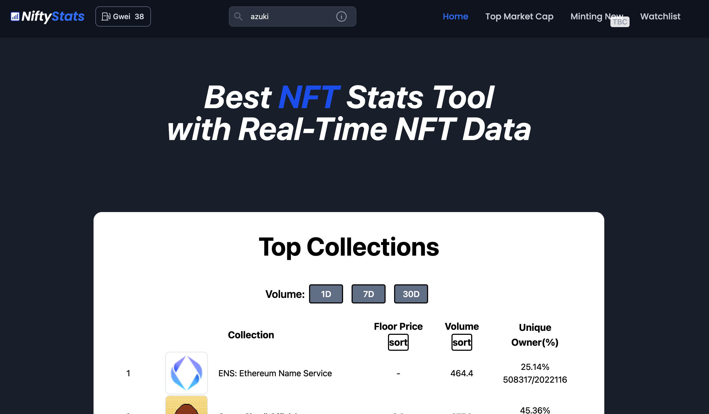

# Nifty Stats

Nifty Stats an NFT web application tool to track NFT collection statistics. Statistics feature a variety of information, including the top collections based on volume, most recent sale transaction, the largest market capitalization, and an updated Ethereum gas tracker (gwei).

## Live Version

This app is deployed on https://project-2-nft-stats.vercel.app/

## User Flow

There are 4 types of Pages in total:

### HomePage

- Top collections based on volume and instructions on how to use are shown here
- Search collection slug name or click on a collection to proceed to stats page

### Stats

- Reflects a banner(upon clicking the extrenal URL icon(top right) will lead to NFT site page)
- Reflects volume change over 1, 7 and 30 days
- Reflects line chart plotted (Sol projects will not be reflected here)
- Ethereum gas fee(gwei) will refresh every 10s

### Top Market Cap

- A treemap of the top market cap (floor price x total supply)

### Watchlist

- Collection added on watchlist will be reflected here
- Floor price, Total volume and market cap will be shown here

## Built With

- HTML
- CSS
- JavaScript
- React
- Vite
- Tailwind(CSS Library)
- Daisy UI(Tailwind CSS Component Library)
- Ant Design Charts(React Component Library)

## Data Used

Data are retrieved from a various sources, including:

- Top collections from https://module.readme.io/reference/about
- A Particular Collection Stats from https://docs.opensea.io/
- Eth Gas Base Fee(fetch every 10s) from https://etherscan.io/apis
- NFT Sales from https://docs.moralis.io/

# Project Flow

- Day 1 : Drafting the layout of the page.
- Day 2-6 : Fetching APIs and rendering data from the state
- Day 7-9 : Plotting charts and debugging.

# Disclaimer

All trademarks, logos and brand names are the property of their respective owners. All company, product and service names used in this website are for identification and illustration purposes only. Use of these names,trademarks and brands does not imply endorsement.

This app is merely for programming practice purposes only. This is not an official NFT tool app. Not recommended to use to monitor actual NFT stats. Not financial advice.
